# Procesverslag
Markdown is een simpele manier om HTML te schrijven.  
Markdown cheat cheet: [Hulp bij het schrijven van Markdown](https://github.com/adam-p/markdown-here/wiki/Markdown-Cheatsheet).

Nb. De standaardstructuur en de spartaanse opmaak van de README.md zijn helemaal prima. Het gaat om de inhoud van je procesverslag. Besteedt de tijd voor pracht en praal aan je website.

Nb. Door *open* toe te voegen aan een *details* element kun je deze standaard open zetten. Fijn om dat steeds voor de relevante stuk(ken) te doen.

## Jij

  
uitwerken voor kick-off werkgroep

  ### Auteur:
  Gloria Daniël 

  #### Je startniveau:
  Blauw

  #### Je focus:
  surface plane
 

## Je website

  
uitwerken voor kick-off werkgroep

  ### Je opdracht:
Wondr Experience
https://wondrexperience.com/ams/wondr-experience/

  #### Screenshot(s) van de eerste pagina (small screen): 
Wondr
  

  #### Screenshot(s) van de tweede pagina (small screen):

  
 

## Toegankelijkheidstest 1/2 (week 1)

  
uitwerken na test in 2e werkgroep

  ### Bevindingen
 Tijdens de les heb ik de screenreader van Wondr getest op hun toegankelijkheid. hier zal ik mijn bevindingen benoemen. 

Screenreader voordelen: 
- 

Web Content Accessibility Guidelines voordelen:
- De lettertype was niet al te klein en dus makkelijk te lezen en ook qua content was het makkelijk te volgen
- Qua contrast voor slechtziende voldeed de achtergrond kleur met de tekst goed aan de eisen alleen in de body. 

Screenreader nadelen: 
- geen alt tekst bij sommige foto's
- De screen reader beschreef niet wat er in de  video en foto’s gebeurde. 
- De screenreader is via de tab te navigeren over de website heen, dus een muis is niet altijd nodig
- Niet alle buttons hadden een naam of alleen bij de desktop versie 
- sommige headings zijn niet duidelijk, te vaag en de volgorde klopte niet (1.1)
- sommige links waren alleen nummers dus je weet niet wat het is (1.2)

Web Content Accessibility Guidelines nadelen:
- heeft het alleen een light mode. 
- Er staat tekst in de afbeeldingen die niet wordt voorgelezen
- het was niet mogelijk om de video en de carrousel op pauze te zetten 

Al om al heeft de website dus veel verbeteringen nodig om de toegankelijkheid te verbeteren.

  
  

## Breakdownschets (week 1)

  
uitwerken na afloop 3e werkgroep

  ### de hele pagina: 
  

  ### dynamisch deel (bijv menu): 
  

## Voortgang 1 (week 2)

  
uitwerken voor 1e voortgang

  ### Stand van zaken

De content in mijn html plaatsen ging best goed. Soms wist ik even niet welke tags ik moest gebruiken maar langzaam begin ik het weer te begrijpen. De breakdown schets heeft hierbij ook erg geholpen. Daarnaast vond ik het lastig om de juiste elementen aan te roepen bij css. Ik deed het vaak te algemeen waardoor andere dingen ook werden veranderd. Nu probeer ik meer gebruik te maken van nth.first of child. Ik heb ge probeert een menu te maken met JavaScript, maar dat is nog niet gelukt. 

  ### Agenda voor meeting
  samen met je groepje opstellen

  Gloria   
  - ik heb een vraag over mijn menu en over dingen aanroepen met css (bijv  root of @media) 
  Manon
  - vraag over dingen aanroepen met css (length of type)
  Rosa
  - vraag over javascript 
  Bob
  - vraag over animaties verwerken 

  ### Verslag van meeting
  deze week was ons feedback moment met de studentassistenten.

- ik moet nog wel alt-teksten toevoegen, anders begrijpt de screenreader niet wat er in de image staat.
 
- de a elementen zijn zo opgebouwd: <a href="/product" >Product</a>
 
- ik moet svg elementen gebruiken voor de sterretjes (i.p.v. image) en die in een ul li doen
 
- form moet worden opgebouwd uit (form, input en een label)
 
- in mijn footer kan ik beter een UL met Li gebruiken
 
- mijn code moet ik beter laten inspringen

## Voortgang 2 (week 3)

  
uitwerken voor 2e voortgang

  ### Stand van zaken

mijn menu met javascript is gelukt en deze week ben ik verder gegaan met een play/pause button maken met javascript voor mijn video. ik had alle stappen gevolgd tijdens de les maar door 1 spelfout werkte het niet(1.1). later zag ik het en toen lukte het gelukkig wel. ik heb nog moeite met positioneren en doe dat nu bijvoorbeeld met position absolute. ik heb dat nu verbeterd met order gap en display flex (1.2).Daarnaast heb ik samen met sanne mijn hele html gecobntroleerd omdat daar nog een aantal foute in zaten. ik heb dat dus eerst verbeterd voordat ik aan andere dingen begon. 

  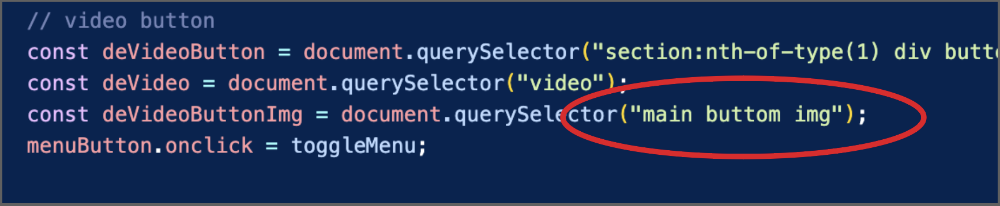
    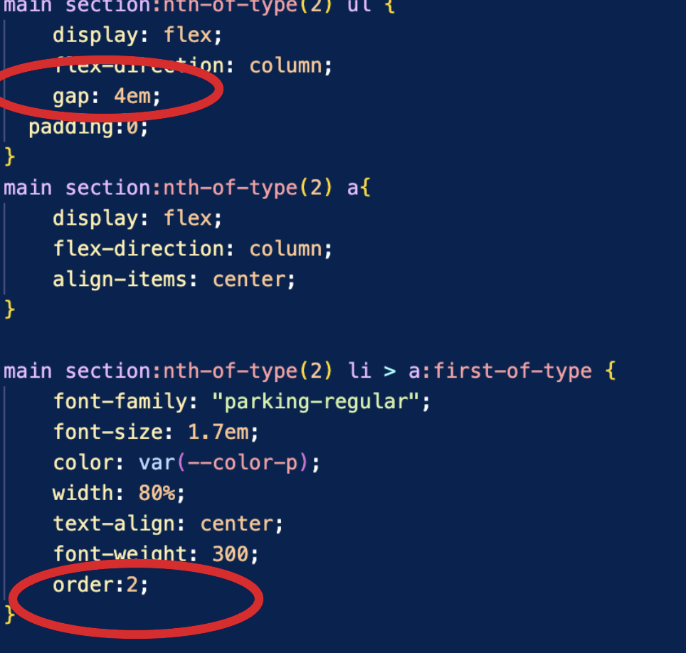

  ### Agenda voor meeting
  samen met je groepje opstellen

1. Gloria
- ik heb een vraag over over postioneren, (relative absolute), 
- :root light en dark mode gebruiken,
- ruimte verwijderen in footer 

2. Manon 
Mijn vragen zijn:
- menu close icon fiksen
- dark modus
- elementen komen door mijn menu heen.
- de prijs moet bold, maar hoe kan dat het makkelijkst

3. Rosa
- datum toevoegen 

4. bob 
- Vraag over animeren van de slideshow 

  ### Verslag van meeting
  hier na afloop snel de uitkomsten van de meeting vastleggen
  deze week was ons feedback moment met sanne.
  - light-dark mode vraag voor buttons color-scheme gefixt 
  - lettertype regular semi bold en bold
  - geen relative en top gebruiken. display: block; op het a element toevoegen. atje order 1 geven

## Toegankelijkheidstest 2/2 (week 4)

  
uitwerken na test in 9e werkgroep

  ### Bevindingen
  Lijst met je bevindingen die in de test naar voren kwamen (geef ook aan wat er verbeterd is):

Screenreader verbeteringen:
- headings zijn op een logische volgorde en hebben duidelijkere namen (1.1 & 1.2)
-
-
-
  
  
  
Web Content Accessibility Guidelines verbeteringen:
- het heeft nu een light en dark mode (1.1)
- video kunnen pauzeren
- kan niet meer horizontaal scrollen
- h1 elementen gebruiken
- geen javascript & css in html
- geen heading levels skippen 
- 1 h1 per pagina
- tekst in img in de alt telkst
- animaties hebben reduce motion (1.4)
- kleuren contrast verbeterd (1.3)

  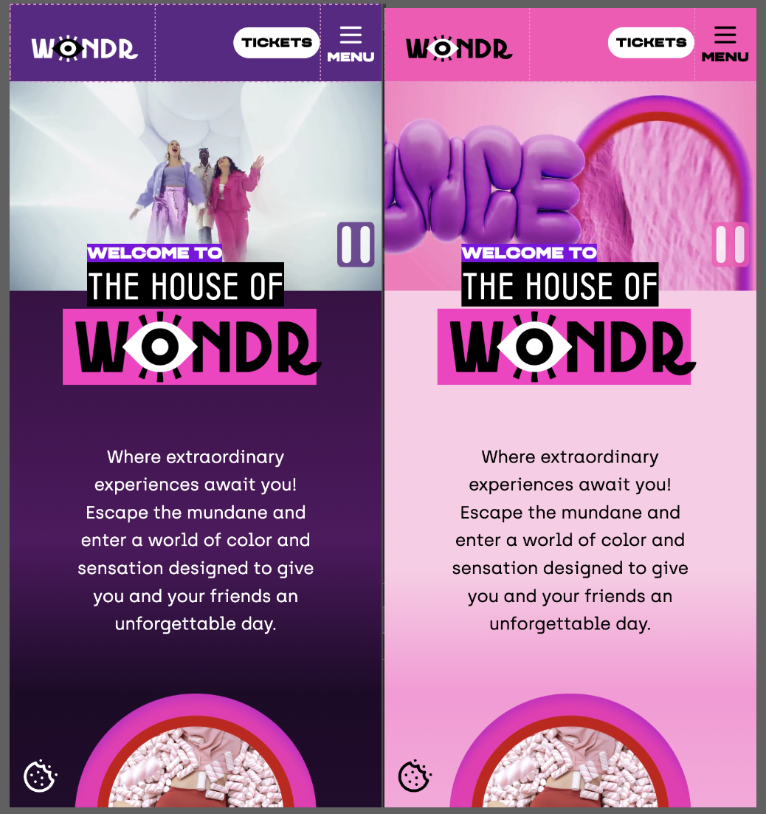
  
   
   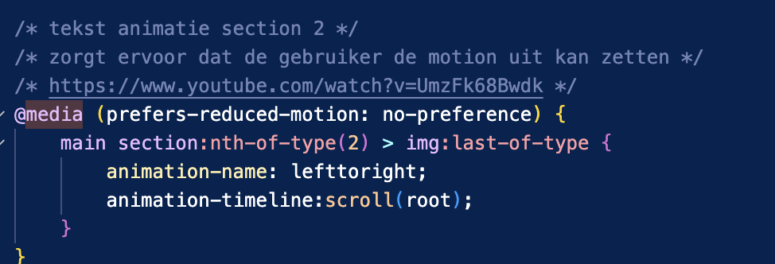
    

foto's Web Content Accessibility Guidelines boekje:
  
  
  
  
  

## Voortgang 3 (week 4)

  
uitwerken voor 3e voortgang

### Stand van zaken
deze week ben ik verder gegaan mijn mijn light en dark mode. Ik had moeite met mijn gradient veranderen omdat het elke keer op 1 kleur bleef hangen. ik had het aan de studentassistenten gevraagd maar hun konder er ook niet uitkomen(1.1). Na veel proberen samen met hun was het toch gelukt met @media (1.2).Ik had ook moeite met de forms en damien had een voorbeeld laten zien, maar ik had van elke input een formulier gemaakt. daarnaast heb ik minder padding en margin gebruikt en ben ik elemnten op een betere manier gaan centreren. 

  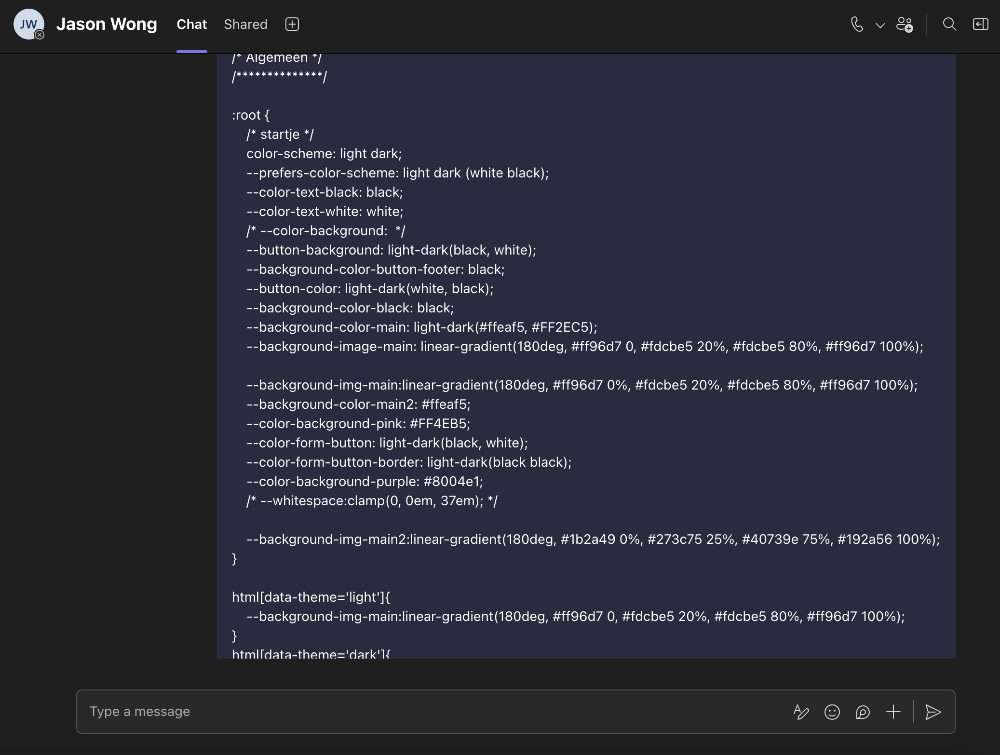
    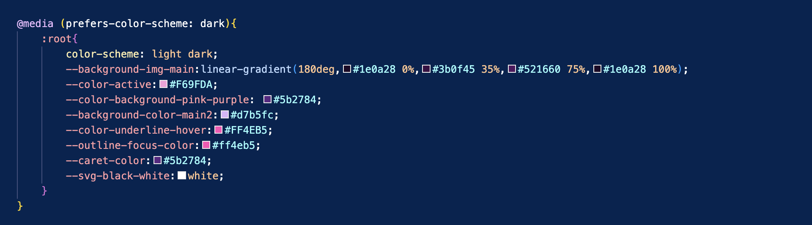

  ### Agenda voor meeting
  samen met je groepje opstellen

Gloria
- wanneer % en wanneer em gebruiken
- h2 centreren bij gekleurde kopjes (doe het nu met left)
- text animatie laten sliden met keyframes
- padding 4 of 2 waardes

Manon
- blauwe rand van de focus weghalen
- favorieten hartje op de party pagina verplaatsen
- Surface plane, welke elementen, wat houdt elk ding percies in.
 
Rosa 
- graag padding gebruiken zonder padding

Bob
- Ik wil weten hoe ik de carousel op een correcte manier kan verwerken

  ### Verslag van meeting
  deze week was ons feedback moment met de studentassistenten.
  - geen border tijdens hover state toevoegen
  - animation-timeline toevoegen voor de scroll animatie 

## Eindgesprek (week 5)

  

  lijst surface plane elementen:
  1. video (kan gepauzeerd worden)
  2. Prefers-reduced-motion (bij animaties)
  3. scroll animatie ( bij text section 2)
  4. Wat omvangrijkere formulieren met styling (events pagina)
  5. SVG (icons) stylen en animeren (home en events pagina)
  6. Animaties feedback/nadruk (events pagina)
  
  

  ### Je uitkomst - karakteristiek screenshots:
  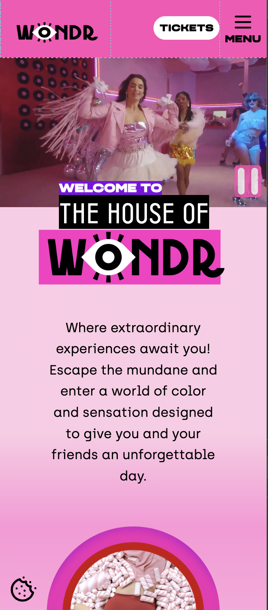
 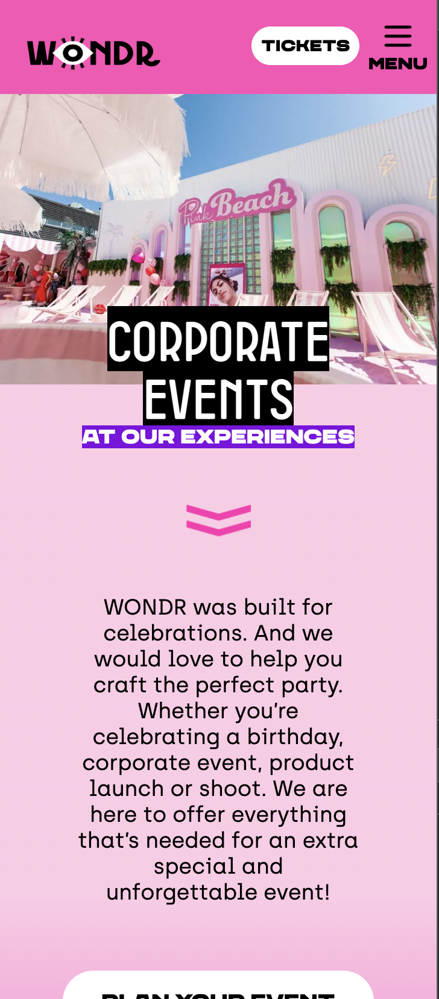

  ### Dit ging goed/Heb ik geleerd: 
  - positineren, display flex, display grid enz. (1.4)
  - light & dark mode (1.3)
  - : root en & @media (1.3)
  - svg'tjes gebruiken
  - menu maken (1.5)
  - verschillende states toevoegen

   
   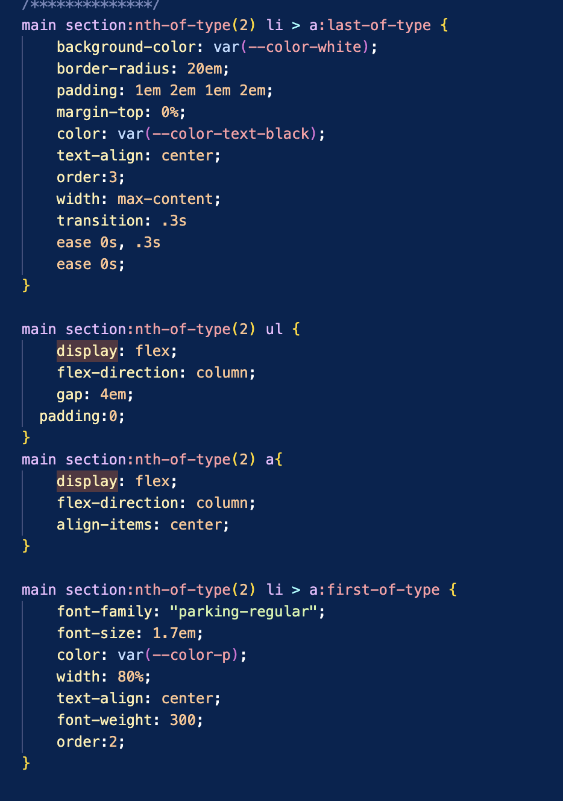
   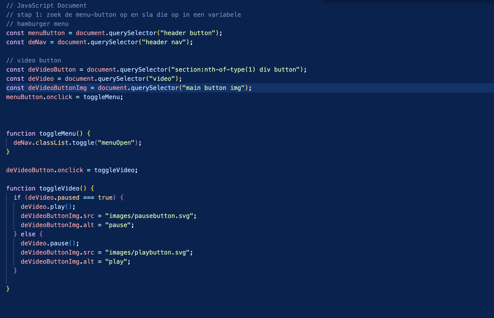

  ### Dit was lastig/Is niet gelukt:
  - de video automatisch laten stoppen als bij reduce motion (1.6)
  - carousel met klikbare knoppen
  - border groen/rood worden na iets ingevuld te hebben (1.7)
  - custom theme bijv kerst of halloween

  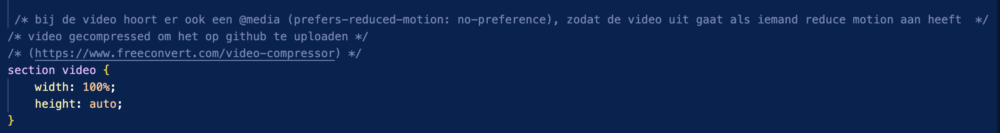
    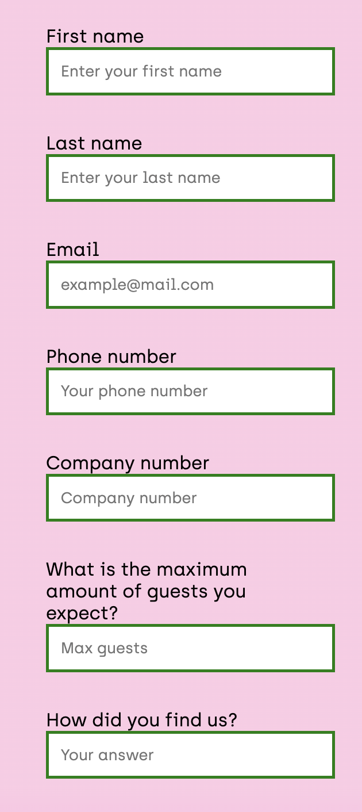

## Bronnenlijst

  
continu bijhouden terwijl je werkt

  1. [bron 1] (a11yproject.com/posts/how-to-hide-content/)
  2. [bron 2] (https://www.freeconvert.com/video-compressor)
  3. [bron 3] (https://www.svgrepo.com/)
  4. [bron 4] (https://www.youtube.com/watch?v=UmzFk68Bwdk)
  5. [bron 5] (https://www.w3schools.com/graphics/svg_stroking.asp)
  6. [bron 6] (https://courses.cs.washington.edu/courses/cse154/17au/styleguide/html-css/spacing-indentation-html.html)
  7. [bron 7] (https://chatgpt.com)
  8. Sanne & de studentassistenten

 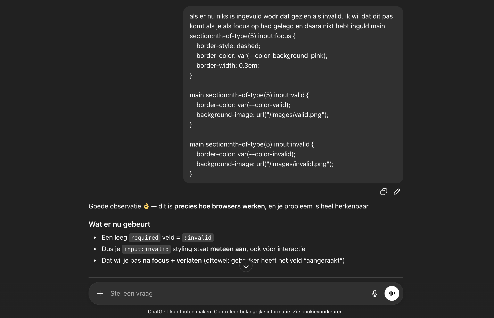
  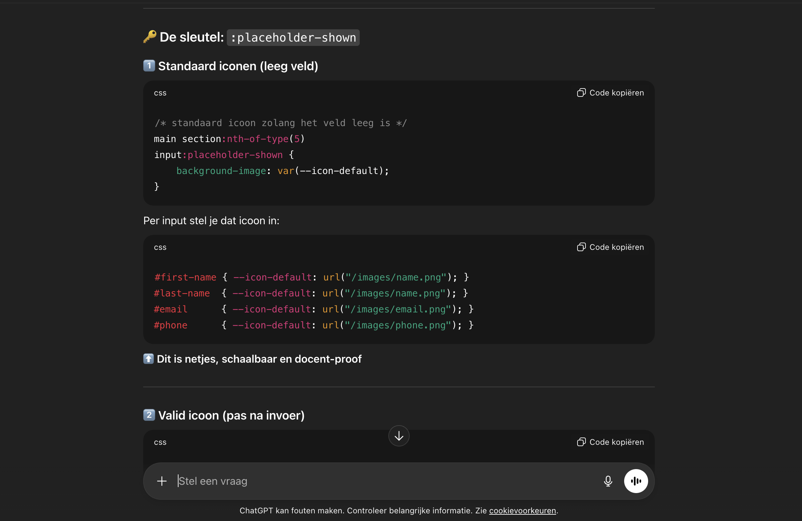

